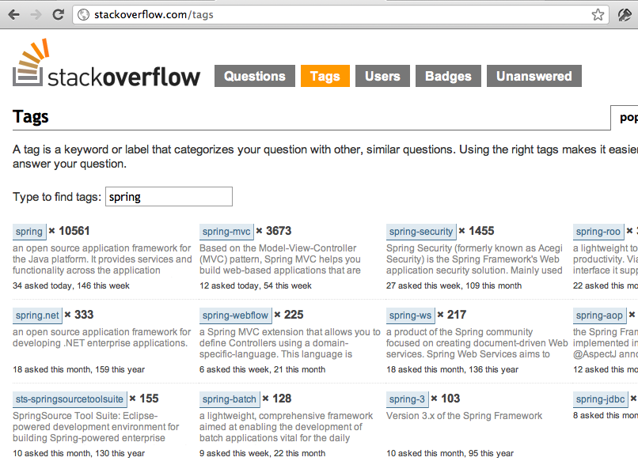
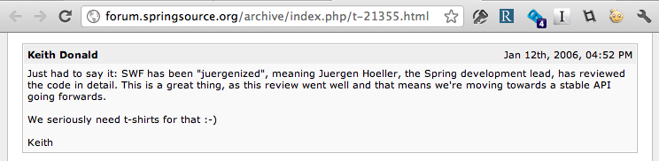

!SLIDE subsection
# Getting Involved with Spring `101`
  
## Chris Beams
### _SpringSource, VMware_

!SLIDE
# Hello!

!SLIDE incremental bullets
# Chris Beams
* Committer, core Spring Framework

!SLIDE subsection bullets incremental
# goals
* broad overview
* getting involved today
* sneak preview of next gen processes

!SLIDE subsection
# the spring landscape today

!SLIDE
# what is Spring?

!SLIDE
# a framework?

!SLIDE
# a collection of projects?

!SLIDE
# a community?

!SLIDE
# Yes.

!SLIDE
# `spring-framework`

!SLIDE smaller incremental bullets
* `spring-framework`
* `spring-integration`
* `spring-batch`
* `spring-data-*`
* `spring-roo`
* `spring-webflow`
* `spring-social`
* `spring-amqp`
* `spring-hadoop`

!SLIDE center transition=fade

!SLIDE incremental
# many projects, one goal:

!SLIDE smaller incremental transition=scrollLeft
# provide infrastructural support for enterprise applications

!SLIDE smaller
# (and there&apos;s a _lot_ of infrastructure out there)

!SLIDE incremental
# many projects, common resources.

!SLIDE incremental bullets
# [springsource.org](http://springsource.org)
* completely redesigned

!SLIDE incremental bullets
# issue tracking
* [jira.springsource.org](http://jira.springsource.org)

!SLIDE small incremental bullets
# source control
* [http://fisheye.springsource.org](http://fisheye.springsource.org)
* Subversion, e.g
* [http://src.springframework.org/svn/spring-framework](http://src.springframework.org/svn/spring-framework)
* Git [http://git.springsource.org](http://git.springsource.org)
* GitHub [http://github.com/SpringSource](http://github.com/SpringSource)

!SLIDE incremental bullets
# continuous integration
* [build.springsource.org](https://build.springsource.org)

!SLIDE incremental bullets
# quality control
* [sonar.springsource.org](https://sonar.springsource.org)

!SLIDE incremental bullets
# artifact management
* Maven Central
* [search.maven.org](http://search.maven.org)
* SpringSource S3 maven repositories
* (more on all that in a bit)

!SLIDE incremental bullets
# forums
* [forum.springsource.org](http://forum.springsource.org)

!SLIDE
# how we manage our projects

!SLIDE incremental bullets
# "benevolent dictator" model
* relatively small teams
* strong leadership
* community input

!SLIDE small incremental bullets
# how we design
* deep subject matter expertise
* internal peer review
* feedback from R&D, consultants, sales engineers
* distilling jira issues, forum posts
* conservative releases
* solve for real-world problems

!SLIDE small incremental bullets
# how we test
* proper unit testing, integration testing
* use by other project teams
* use by our engineers in the field
* feedback from users against milestones and RCs

!SLIDE small incremental bullets
# who commits
* meritocracy
* typically employees
* typically strong users we&apos;ve hired
* increasing number of external committers

!SLIDE small incremental bullets
# how we release
* `snapshot->milestone->RC->GA`
* relatively long release cycles
* plenty of feedback
* mostly successful model over time

!SLIDE
# every project is a little different

!SLIDE smaller incremental bullets
# every project is a little different
* share process where it makes sense
* but do what&apos;s right for each team
* build systems are a good example

!SLIDE incremental bullets
# Example
* `spring-framework` issue management

!SLIDE incremental bullets
# Managing SPR JIRA
* [https://jira.springsource.org/browse/SPR](https://jira.springsource.org/browse/SPR)
* 8800+ issues
* Daily triage
* Backlog versions

!SLIDE incremental bullets
# `</overview>`

.notes ----------------------------

!SLIDE subsection
# ways to get involved

!SLIDE incremental bullets
# ways to get involved
* Use the projects!
* Report issues
* Help other users
* Track and test latest features
* Participate in user groups
* Contribute code and other fixes

!SLIDE incremental bullets
# first things first
* using Spring projects

!SLIDE incremental bullets
# quick start
* (for the impatient)

!SLIDE subsection bullets
# demo
* STS template projects

!SLIDE bullets
# read the documentation
* [http://www.springsource.org/documentation](http://www.springsource.org/documentation)

!SLIDE small bullets incremental
# grab the artifacts
* via distribution zips [http://www.springsource.com/download/community](http://www.springsource.com/download/community)
* via Maven Central (preferred) [http://search.maven.org](http://search.maven.org)

!SLIDE bullets incremental
# learn from samples and reference applications

!SLIDE bullets
# samples
* [http://www.springsource.org/samples](http://www.springsource.org/samples)

!SLIDE small bullets incremental
# reference applications
* greenhouse
* live app [http://greenhouse.springsource.org](http://greenhouse.springsource.org)
* home [http://www.springsource.org/greenhouse](http://www.springsource.org/greenhouse)
* code [https://github.com/SpringSource/greenhouse](https://github.com/SpringSource/greenhouse)

!SLIDE bullets incremental
# Spring Roo
* [http://www.springsource.org/spring-roo](http://www.springsource.org/spring-roo)
* rapid application development
* Spring best practices built in

!SLIDE bullets incremental
# tutorials
* [http://www.springsource.org/tutorials](http://www.springsource.org/tutorials)

!SLIDE
# stay informed

!SLIDE bullets incremental
# blogs
* team blog [http://blog.springsource.org](http://blog.springsource.org)
* news feed [http://springsource.org](http://springsource.org)
* RSS for both

!SLIDE smaller bullets
# newsletter
* [http://www.springsource.com/newsevents/newsletter-registration](http://www.springsource.com/newsevents/newsletter-registration)

!SLIDE bullets incremental
# Twitter
* [http://twitter.com/springsource](http://twitter.com/springsource)
* [http://twitter.com/springsource/projects](http://twitter.com/springsource/projects)
* [http://twitter.com/springsource/employees](http://twitter.com/springsource/employees)

!SLIDE bullets incremental
# Twitter
* [http://twitter.com/springframework](http://twitter.com/springframework)
* [http://twitter.com/springframework/team](http://twitter.com/springframework/team)

!SLIDE
# report issues

!SLIDE bullets incremental
# improvements & new features
* share use cases
* vote!

!SLIDE bullets incremental
# bugs
* steps to reproduce are critcal
* but reproduction _projects_ get you ♥

!SLIDE bullets incremental
# repro projects
* simple as possible
* self-contained
* built with Maven or Gradle

!SLIDE smaller incremental bullets
# `spring-framework-issues`
* [https://github.com/SpringSource/spring-framework-issues](https://github.com/SpringSource/spring-framework-issues)
* repro projects, streamlined
* especially helpful for web application issues

!SLIDE incremental bullets
# help other users
* (and get help when you need it too)

!SLIDE incremental bullets
# [forum.springsource.org](http://forum.springsource.org)
* thousands of users
* great way to build a presence in the community

!SLIDE
# [stackoverflow.com](http://stackoverflow.com)

!SLIDE center

!SLIDE
# track and test the latest features

!SLIDE bullets incremental
# snapshots, milestones, RCs
* http://maven.springframework.org/snapshot
* http://maven.springframework.org/milestone
* http://maven.springframework.org/release

!SLIDE bullets incremental
* all based on Amazon S3
* resolvable from Maven
* but not _browseable_
* [http://shrub.appspot.com](http://shrub.appspot.com/maven.springframework.org/snapshot/)

!SLIDE incremental bullets
# participate in user groups
* google for 'spring user group' in your area
* java user groups often have spring content
* if they don&apos;t, consider giving a talk!
* interested in starting a group?
* contact `afitzgerald@vmware.com`

!SLIDE
# contribute code and other fixes

!SLIDE incremental bullets
# first: why contribute?
* scratch your own itch
* get to know Spring _really_ well
* improve your skills
* street cred, yo.

!SLIDE subsection bullets
# demo
* contributor attribution in git projects

!SLIDE incremental bullets
# kinds of contribution
* typo fixes, documentation, cosmetic
* minor bug fixes and improvements
* major stuff

!SLIDE incremental bullets
# how to do it
* and what to expect

!SLIDE incremental bullets
# the small stuff
* typo? doco?
* just submit a patch or pull request
* (we&apos;ll talk about pull requests shortly)

!SLIDE
# the bigger stuff

!SLIDE incremental bullets
# it&apos;s about communication
* create/comment on the issue
* express interest, start a conversation
* discuss possible implementations
* build trust

!SLIDE smaller incremental bullets
# study previous patches and pull requests
* what kinds of submissions have been accepted before?
* code quality, formatting, etc

!SLIDE smaller subsection incremental bullets
# demo
* `spring-integration` pull requests
* [https://github.com/SpringSource/spring-integration/pulls](https://github.com/SpringSource/spring-integration/pulls)
* [https://github.com/SpringSource/spring-integration/pull/153](https://github.com/SpringSource/spring-integration/pull/153)

!SLIDE incremental commandline
# grab the source
    $ svn checkout https://github.com/cbeams/spring-framework.git
    ...

    $ git clone https://github.com/cbeams/spring-framework.git
    ...

!SLIDE
# git `||` svn
  
  
  
  
  
  
  
  
  
  
 

!SLIDE incremental bullets transition=fade
# git `&&` svn
* GitHub supports both!
* [https://github.com/blog/966-improved-subversion-client-support](https://github.com/blog/966-improved-subversion-client-support)
* your choice

!SLIDE incremental bullets
# look at the commit log
* plan to emulate it

!SLIDE small subsection incremental bullets
# demo
* `spring-framework` commit log
* [http://progit.org/book/ch5-2.html#commit_guidelines](http://progit.org/book/ch5-2.html#commit_guidelines)

!SLIDE small incremental bullets
# get to know the project build system
* Ant ("spring-build")
* Gradle ("spring-build-gradle")
* Maven (individual to each project)
* S2 team blog: [building Spring 3](http://blog.springsource.com/2009/03/03/building-spring-3/)

!SLIDE small incremental bullets
# give it a shot!
* stay in communication with project team
* not every contribution will necessarily make it
* process should be rewarding in any case

!SLIDE small incremental bullets
# _(and don&apos;t forget tests!)_

!SLIDE incremental bullets
# in any case
* expect your code to be changed

!SLIDE center incremental bullets
# "Juergenization"
* 
* 

!SLIDE small incremental bullets
# legal stuff
* You may be asked to sign our CLA
* SpringSource [Contributor License Agreement](https://support.springsource.com/spring_committer_signup)

!SLIDE small incremental bullets
# contributing through external projects
* Example: Spring Social core & Spring Social Foursquare
* [https://github.com/springsource/spring-social](https://github.com/springsource/spring-social)
* [https://github.com/mattupstate/spring-social-foursquare](https://github.com/springsource/spring-social
https://github.com/mattupstate/spring-social-foursquare)

.notes ----------------------------

!SLIDE subsection incremental bullets
# sneak preview
* getting involved 2.0

!SLIDE incremental bullets
# source control improvements
* everything on GitHub

!SLIDE
# pull requests are...

!SLIDE
# the new patch

!SLIDE
# the new code review

!SLIDE subsection bullets
# demo
* pull request / fork and edit

!SLIDE bullets incremental
# next steps
* complete the migration of projects
* `spring-framework` post 3.1 GA
* only a few remaining after that

!SLIDE smaller bullets incremental
# integrate pull requests into our JIRA workflow
* [http://seam-framework.2283336.n4.nabble.com/git-pull-request-JIRA-workflow-td3272708.html](http://seam-framework.2283336.n4.nabble.com/git-pull-request-JIRA-workflow-td3272708.html)
* [http://community.jboss.org/wiki/GuideToUsePullRequestsWithGitHubAndJIRA](http://community.jboss.org/wiki/GuideToUsePullRequestsWithGitHubAndJIRA)

!SLIDE bullets incremental
# improved artifact management
* Artifactory
* [http://repo.springsource.org](http://repo.springsource.org)

!SLIDE subsection bullets incremental
# demo: repo.springsource.org
* unified search
* put a watch on anytihng
* license information
* transitive resolution
* migration path from s3 repos

!SLIDE bullets incremental
# streamline CLA process
* deep integration via GitHub hooks API
* CLA database
* revised CLA agreement, web-only form

!SLIDE subsection bullets
# Thanks!
* <a href="http://twitter.com/cbeams">`@cbeams`</a>
* this presentation on the web: <a href="http://cbeams.github.com/spring-community-101">http://cbeams.github.com/spring-community-101</a>
